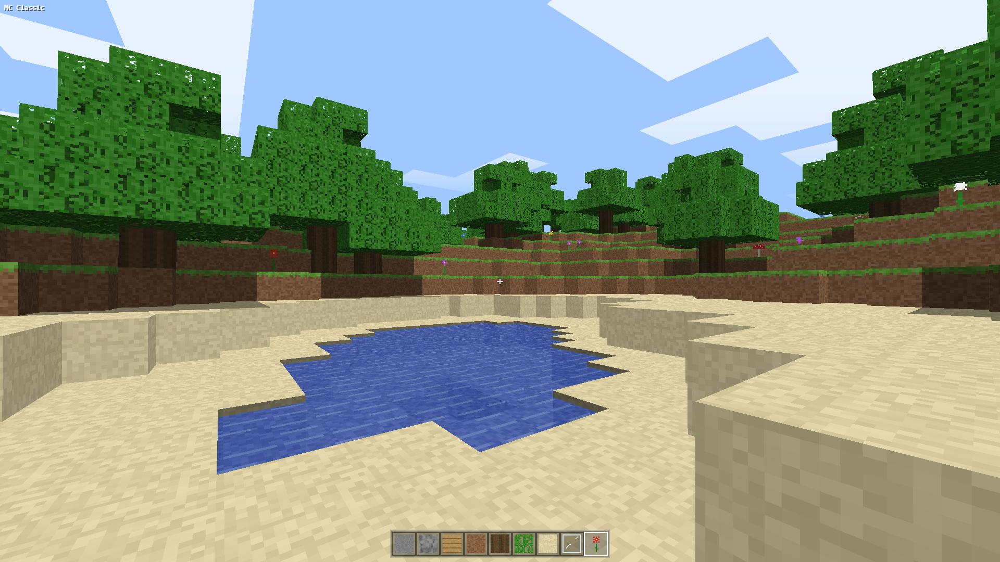

# MC Classic

Minecraft Classic clone written in Three.js. Finite procedural world
(128×128×64) surrounded by ocean, chunk-based voxel meshing, procedural
pixel-art texture atlas, flowing water with sponges, caves with surface
entrances, trees, ores (coal / iron / gold / diamond), 16 wool colors,
flowers in five colors, and 5 world save slots stored in localStorage.

**Live demo:** https://szabolevi98.github.io/mc-classic

## Controls

| Input | Action |
|---|---|
| `WASD` | Move |
| Mouse | Look |
| `Space` | Jump / swim up |
| `Left Shift` | Sprint |
| Left click | Dig block |
| Right click | Place block |
| Middle click | Pick block |
| `B` | Select block menu |
| `1`–`9` / wheel | Hotbar slot |
| `ESC` | Pause (save / quit) |

## Features

- Procedural terrain: hills, beaches, island falloff into an endless ocean
- Caves (worm tunnels + caverns) with occasional stone-lined surface entrances
- Water that flows and floods dug holes, sponges absorb and block it
- Bumpy 1-3 block bedrock floor, classic-style clouds and fog
- No inventory, no health, no mobs, pure Classic creative building
- 5 save slots (RLE-compressed worlds in localStorage), autosave every minute
- Optional mobile touch controls (joystick, look-drag, dig/place/jump buttons)
- Optional fullscreen + landscape lock on mobile
